-   [封面](#cover)

-   [番茄脚本简介](javascript:void\(0\);)

    -   [什么是番茄脚本？](#144)

-   [描述头](javascript:void\(0\);)

    -   [描述头说明](#154)

    -   [脚本注释](#166)

-   [曲部分](javascript:void\(0\);)

    -   [简谱主体说明](#155)

    -   [基本音符/休止符](#120)

    -   [增时线/减时线](#152)

    -   [自定义节拍切分](#178)

    -   [附点音符](#122)

    -   [力度/渐强/渐弱](#134)

    -   [升降音/还原符号](#123)

    -   [装饰音（倚音）](#128)

    -   [伴奏部分的括弧](#150)

    -   [其他常用音符符号](#130)

    -   [音符注释](#129)

    -   [小节线](#125)

    -   [小节线上的反复符号](#153)

    -   [连音线](#127)

    -   [连音/多连音](#124)

    -   [跳房子](#126)

    -   [临时拍号](#131)

    -   [临时伴奏/临时多声部](#132)

    -   [多声部](#143)

    -   [分页](#167)

-   [歌词部分](javascript:void\(0\);)

    -   [中文歌词](#148)

    -   [歌词注释](#151)

    -   [英文歌词特别说明](#149)

-   [提交建议/BUG反馈](#145)

# 番茄脚本简介

## 什么是番茄脚本？

番茄脚本，全程是番茄简谱脚本，是由我们参考国外流行的ACB记谱法，同时结合简谱的特性所设计的一套简谱脚本。
简单的说，番茄脚本就是通过普通的文本的形式，将简谱完整的描述出来的一种规范。
通过番茄脚本，可以快速的将一篇简谱录入到计算机中处理。

## 番茄脚本的结构
一个完整的番茄脚本，应由描述头和简谱主体构成。
描述头：主要是记录一些简谱的基础信息，像标题、词曲作者、调式、拍号、拍子等。
简谱主体：记录着每一行的词和曲的信息。

一个简单的示例：
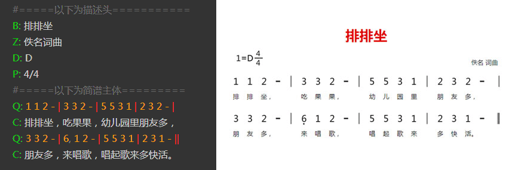
上图中，左侧是一个简单番茄脚本。右侧是将其导入到相应软件后得到简谱图片。

这是一个非常简单是示例，当然在实际应用中还会更跟复杂的谱子出现，但是番茄脚本已经解决了大部分的需求，包括各种符号和多声部的输入等。具体请参看本手册的相应章节。

## 番茄脚本的优点：
1、速度快，当您熟练以后，将实现以打字的速度录入简谱，比使用其他简谱软件排版快的多。
2、编写方便，只要能够输入文本的编辑器都可以编写（记事本、Word、手机编辑器）。
3、通过相应软件，可以很方便的生成高质量的简谱图片或MIDI音频，同时分享到互联网中。

# 描述头

## 描述头说明
描述头图例
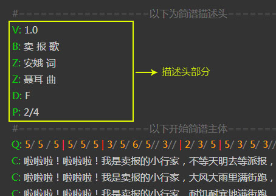
以上脚本中，以“#”开头的行是注释行，仅方便阅读，无实质作用。

### 描述头字段说明
描述头是由许多行组成，一般写在脚本顶部。每行标记一项简谱或脚本的基本信息，如：标题、副标题、作者、调式等。每一项信息使用“大写字母”作为标识，每个大写字母的意义如下：

字母	说明	示例	必须
V	版本号	V: 1.0	是
B	标题	B: 排排坐	是
Z	作者	Z: 佚名 词曲	-
D	调式	D: E	是
P	拍号	P: 4/4	是
J	节拍	J: 6 或 J: 欢快的	-
### V 脚本版本号

用来指定当前谱脚本是使用哪个版本的脚本规范，主要是因为后期可能会对脚本规范进行调整，衍生出不同的版本规范。

### B 曲谱标题

由于一些曲谱有主标题还有附标题，所以B字段可以多次出现。第一次出现将被认为是主标题，第2词以后出现的被认为是附标题。
在番茄简谱软件中，曲谱标题是居中显示的，也可以用来写居中显示的其他文字。

### Z 作者

由于一般情况下曲谱作者可能有多个，所以Z字段可以出现多次。
在番茄简谱软件中，作者分别由上到下地居右显示，也可以用来显示列在乐谱右上边的其他文字。

### D 调式标志

调式必须是一个大写的字母，在字母后面可以加”＃”或“$”表示升降调。

### P 拍号

使用“/”作为分号线，写法如：P:6/8  或  P:4/4，同时可以指定多个拍号，例：p:4/4 2/4；辅助拍号也可以加上括弧，例如：P:4/4 ( 2/4 1/4 )

### J 节拍

节拍可以使用数字或文字表示，当使用数字时，软件将识别为每分钟的拍子数。如果使用文字描述，则直接将文字显示在拍号下方位置。可以两者并存。

## 脚本注释

以“#”开头的行是作为脚本注释所用，仅作为标注脚本说明等用。在软件渲染的时候，将被忽略。

# 曲部分

## 简谱主体说明

简谱主体仅包含词和曲两种内容，每行内容对应简谱中的每一行，行开头以Q或C定义内容类型，Q表示曲，C表示词。如下图：
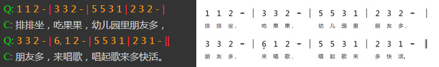

需要注意的是，主体中的词是依附于上一行的曲的。所以主体应该以Q（曲）开头。而一行曲可以对应多行词，就像下面这样：

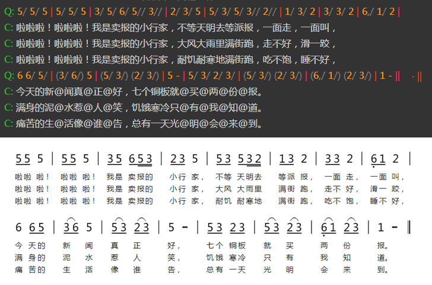

## 普通音符
普通音符使用“1-7”数字表示，对应简谱的“1、2、3、4、5、6、7”这7个音符。增时线使用“-”表示。如下图：

## 休止符
休止符使用数字“0”表示，而数字“8”则表示隐藏的休止符（在谱面上不可见，但是占据相应的空间）。

## 节奏音符
节奏音符“X”使用数字“9”表示。

示例：

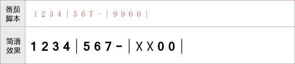

## 高低音的表示
高音使用“'”表示，低音使用“,”表示。跟在数字后面即可。高低音符号可以有多个，如下图所示：

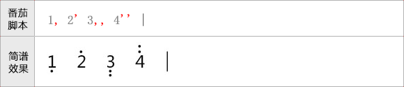

## 增时线/减时线

增时线使用“-”表示，如下图：

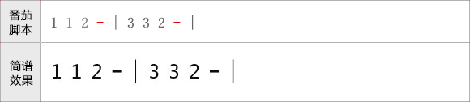

减时线（时值线）使用“/”表示，跟在音符数字的后面，一个音符可以包含多个。如下图：

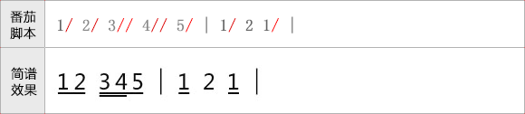

## 自定义节拍切分

因为番茄脚本开发初期的失误，导致自动节拍都是以四分音符为一拍进行自动切分的。

因此，导致例如6/8和一些特殊情况的节拍切分不能实现。

为了解决此问题，后期我们增加了“~”和“^”来协助实现自定义切分节拍。

“~”符号的作用：让前后音符串接在一个节拍中。

“^”符号的作用：让前后音符强制切开为两个节拍。

加入~和^符号只是临时解决问题的策略，我们将在后期的新版中彻底解决此问题。

示例如下：
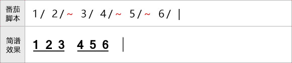

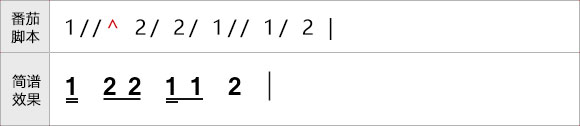

## 附点音符

附点音符，只需要在音符数字后面加上“.”号即可。双附点音符加上两个“.”。如下图：

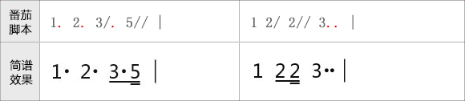

## 力度/渐强/渐弱

力度术语可以在音符后面加上“&+缩写字母”的方式加上，例如mp写上“&mp”即可。

渐强渐弱符号，则使用“<”或“>”表示起点，终点直接使用“!”作为结束记号。

如下图：

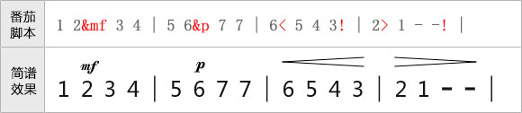

番茄脚本支持的力度术语一览表：

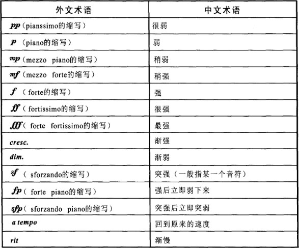

### 渐强减弱符号与连音线等符号重叠问题

有些时候，渐强减弱符会与连音符重叠，此时可以在渐强减弱符的“<”或“>”后加上“+”号进行调整，“+”号越多，渐强减弱符越上移。

示例如下：

图1、渐强减弱与连音线重叠问题:

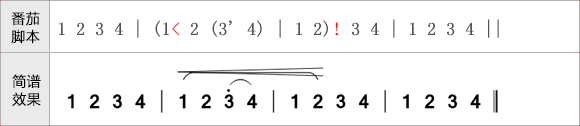

图2、通过“+”号调整渐强减弱符的位置

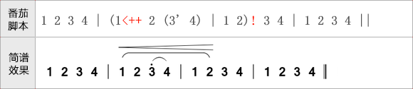

番茄简谱将在以后实现渐强减弱符号位置的自动调整，在此之前请使用“+”号手动调整。

## 升降音/还原符号

升音符使用“#”表示；降音符使用“$”表示；还原符使用“=”表示；以上符号均写在音符数字的后方。如下图：

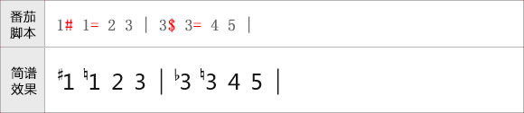

## 装饰音（倚音）

前倚音使用中括号“[]”包含起来即可，跟在音符数字后即可。“[]”括弧中的音符可以包含高低音符号“,”和“'”，同时支持减时线符“/”以及升降音符。后倚音则也使用相同的方法，不同的是要在“[”后面加上一个“h”，例如。

需要注意的是，倚音里的音符，默认就是8分音符，当加了一条减时线后，将变成16分音符。如下图：

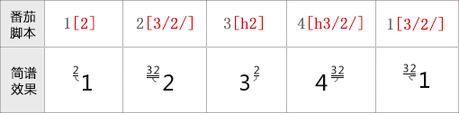

## 伴奏部分的括弧

在曲的伴奏部分，一般会使用括弧括起来。在番茄脚本中，左括弧使用“&zkh”表示，右括弧使用“&ykh”表示。

需要注意的是，不管是左括弧还是右括弧，均写在音符数字的后面。如下图所示：

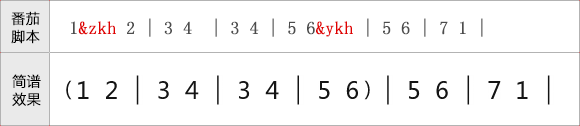

## 其他常用音符符号

在简谱音符中，有非常多的装饰符号。这些装饰符号在番茄脚本中均一般使用“&+符号编码”进行表示。
为了方便记忆，大部分符号的编码是使用符号名称的拼音首字母表示的。常用记号如下表格所示：

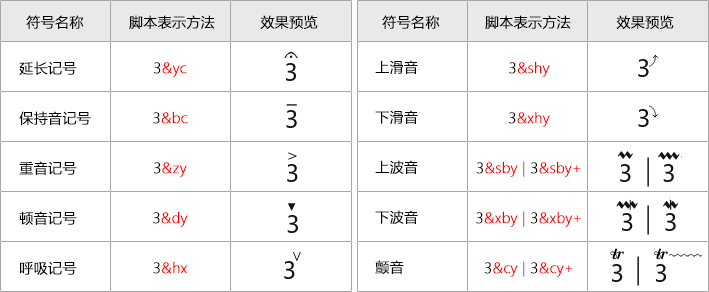

## 音符注释

如果某个音符上方需要注释，只需要在音符数字后面将注释使用双引号包含起来即可，如下图所示：

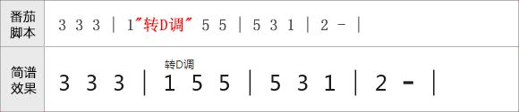

## 小节线

番茄脚本中，各种类型的小节线表示方法，请参考下图：

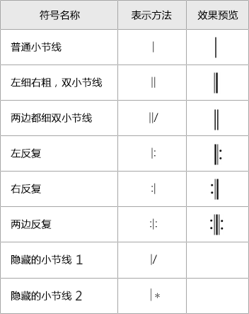

### 隐藏小节线的说明

隐藏小节线1（|/）：此隐藏小节线不会显示，也不会占据排版空间，一般是用于每一行的开头的，因为有些符号是只能在小节线上标注的（例如跳房子的起点），但是每一行的开头一般是省略小节线的。此时就需要使用隐藏的小节线了。

隐藏小节线2（|*）：此隐藏小节线不会显示，但是会占用排版空间，一般用行中间单声部变多声部时。具体情参看多声部章节。

## 小节线上的反复符号

以下反复符号只有在小节线处才可以使用：

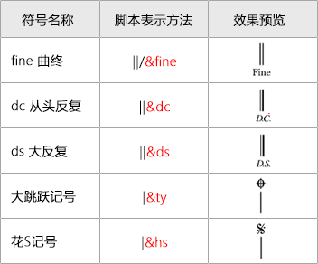

## 连音线

需要用连音线连起来的音符，使用“()”包含起来即可，连音线可以嵌套使用，并且支持跨小节和跨行。
具体如下图所示：

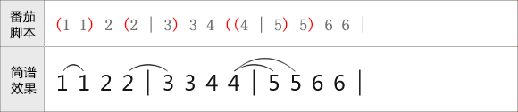

### 跨行连音线

当相同页面中连音线跨行时，请直接使用在第二行编写右括弧即可，如下：

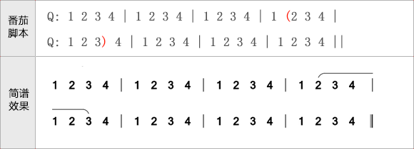

### 切分连音线

有些时候，连音线会被切分。例如跳房子处的连音线和分页处的连音线。此时可以将跳房字的括弧写在小节线处，如下：

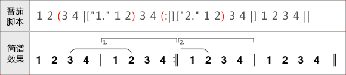

## 连音/多连音

连音和多连音的表示方法和连音线差不多，都使用“()”包含起来，不同的时，连音需要在“(”后面加上小写字母“y”。
连音的音符数软件加自动计算。如下图所示：

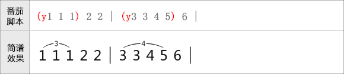

## 跳房子（重音）

跳房子只能在小节线上标注，使用“[]”表示。“[”表示起点，“]”表示终点，跳房子线支持跨行。
小节线下的备注信息，则在小节线后使用引号括起来（类似音符备注）即可。
为了方便后期导出MDID和软件正确播放，跳房子的备注文字建议使用数字表示。
用法如下图所示：

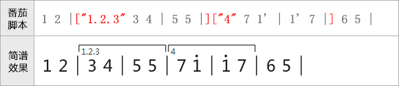

还有一种情况，当跳房子的段落太长的时候，一般跳房子只需要画到前两个小节，然后右侧无需封闭即可。
此中情况，可以在“[”号后面增加“/”符即可。如下所示：

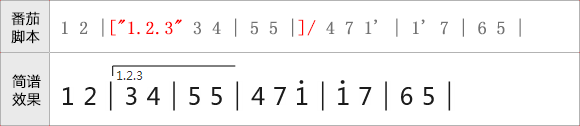

### 跳房子与连音线等重叠问题

有些时候，跳房子默认的高度会与连音符重叠，此时可以在跳房子的“[”后加上“+”号进行调整，“+”号越多，跳房子里音符越远。

示例如下：

图1、跳房子与连音线重叠问题:

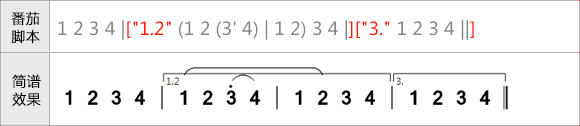

图2、通过“+”号调整跳房子线的位置

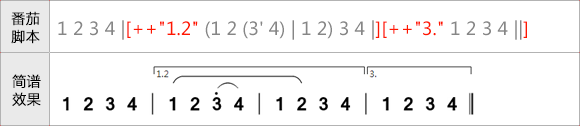

番茄简谱将在以后实现跳房子位置的自动调整，在此之前请使用“+”号手动调整。

### 行开头处的跳房子

跳房子标记只能写在小节线处，但是有些时候跳房子是从行头开始的，而行头却不应该有小节线。此时可以使用隐藏小节线“|/”处理。

如下图所示：

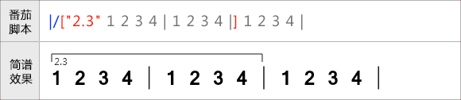

## 临时拍号

临时拍号的定义直接写在小节线的备注中（在小节线后面使用引号包含起来），格式是“p:x/x”。
如下图所示：

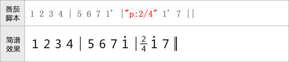

## 临时伴奏/临时多声部

临时伴奏一般是在主唱和伴奏重叠的时候，将伴奏写在主旋律的上方。番茄脚本在表示临时伴奏时，伴奏部分使用“{}”括起来，并且在“{”后面要紧跟着小写字母“bz”。软件会自动将音符和主旋律对齐。如下图所示：

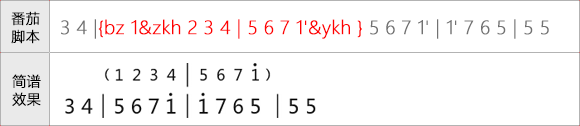

### 临时多声部

临时多声部的方法和临时伴奏差不多，不同的是在“{”符号后面紧跟着的字母换成了“dsb”。如下图所示：

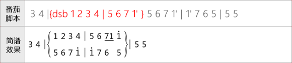

## 多声部

在编写单声部简谱的时候，词曲的行开头是使用“Q”和“C”进行定义的。而当编写多声部时，只需要在每个声部的“Q”和“C”后面加上一个声部编号即可。如下图所示：

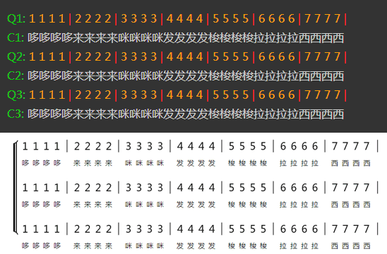
在多声部时，您还可以在声部编号数字的后面用双引号表示声部的名称，如下图：
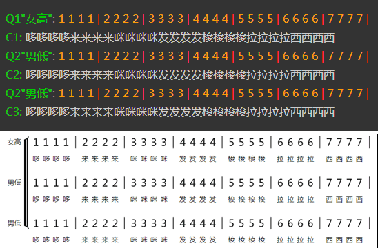

多声部和单声部可以混合使用的，下面是一个示例：
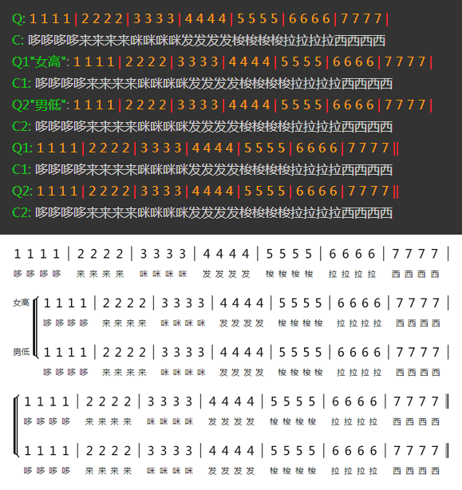

### 自定义声部括弧的位置

有的时，多声部可能是在一行的中间开始的，此时可以在脚本中使用“&sbf”来定义声部括弧的位置。

同时，除第一个声部外的其他声部，在声部符前是没有内容的，可以使用“8”（隐藏空白音符）和“|*”（隐藏小节线）进行填充。

示例如下：

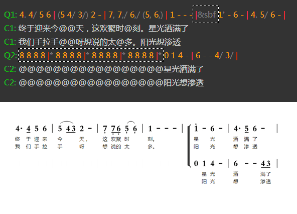

## 分页

番茄简谱目前只能手动分页，需要分页时，请在新一行的脚本中输入“[fenye]”即可。

需要注意的时，连音线不能自动跨页，请参考连音线章节通过切分连音线进行处理。

分页示例如下：

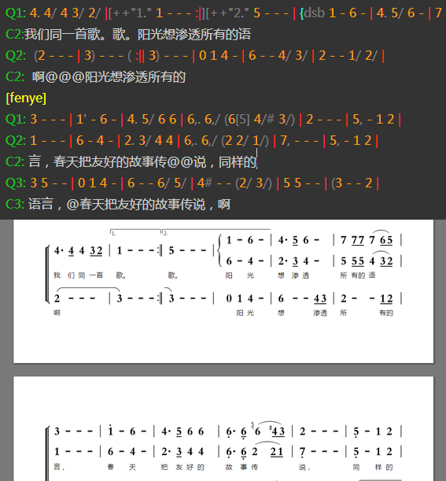
